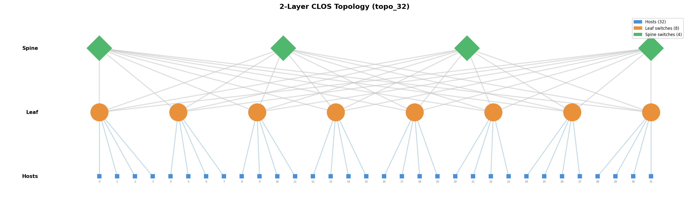

# CLOS Topology Generator

2-layer CLOS (leaf-spine) topology generator for HPC network simulation.
Produces non-oversubscribed fabrics with the minimum number of switches
while maintaining full symmetry and bisection bandwidth.

Google Slide Presentation: [link](https://docs.google.com/presentation/d/1KPUpbwwkNCe5dkujLZHlIwLRMtDhSrhHGaB6vuhhZjk/edit?usp=sharing)

## Task

Build a topology generation script that takes:

- **Switch throughput** -- total switching capacity per switch (e.g. 6400 Gbps)
- **NIC throughput** -- total escape throughput per network card (e.g. 800 Gbps)
- **Link bandwidth** -- per-link bandwidth (e.g. 200 Gbps)
- **Host count** -- total number of hosts (e.g. 128)

And calculates a 2-layer CLOS topology with the minimum number of switches overall while staying symmetric and having no oversubscription.

### Requirements

1. **ID scheme**: `[0, num_hosts-1]` for hosts, `[num_hosts, num_hosts+num_switches-1]` for switches.
2. **Output format**: JSON file containing a list of point-to-point links as `[src, dst, speed]` tuples.
3. **Link aggregation**: Aggregate multiple links between the same device pair when possible.
4. **Port reporting**: Output the utilized ports per layer and the number of switches per layer.

### Stretch Goals

- Robust sweep script over host counts `[4, 8, 16, 32, 64]` (powers of 2), idempotent so re-runs only trigger failed configurations.
- Alternative topology support (e.g. Dragonfly).


## Example CLOS Architecture



Note: The picture above has been generated by this repo (sweep.py)

## Quick Start

```bash
# Install uv (if not already installed)
curl -LsSf https://astral.sh/uv/install.sh | sh

# Generate a single topology
uv run clos-generate \
  --switch-throughput 6400 \
  --nic-throughput 800 \
  --link-bandwidth 200 \
  --num-hosts 128

# Sweep across host counts [4, 8, 16, 32, 64]
uv run clos-sweep \
  --switch-throughput 6400 \
  --nic-throughput 800 \
  --link-bandwidth 200
```

Both commands produce a `.json` topology file and a `.png` network diagram
side-by-side in the output directory (e.g. `output/topo_128.json` +
`output/topo_128.png`).

## Parameters

| Parameter | Required | Description | Example |
|---|---|---|---|
| `--switch-throughput` | Yes | Total switching capacity per switch (Gbps) | 6400 |
| `--nic-throughput` | Yes | Escape throughput per NIC (Gbps) | 800 |
| `--link-bandwidth` | Yes | Per-link bandwidth (Gbps) | 200 |
| `--num-hosts` | Yes | Total number of hosts (single run only) | 128 |
| `--output` | No | Output JSON path (single run only, default: `output/topo_{num_hosts}.json`) | `output/topo_128.json` |
| `--output-dir` | No | Output directory (sweep only, default: `output/`) | `output/` |
| `--force` | No | Re-generate even if output exists (sweep only) | - |

## How It Works

### CLOS Calculation

Given switch throughput `S`, NIC throughput `E`, link bandwidth `B`, and host count `N`:

```
ports_per_switch     = S / B          (e.g. 6400/200 = 32)
links_per_host       = E / B          (e.g. 800/200 = 4)
south_ports          = ports / 2      (e.g. 16)  -- non-oversubscribed split
north_ports          = ports / 2      (e.g. 16)
hosts_per_leaf       = south / links  (e.g. 16/4 = 4)
num_leafs            = N / hosts_per_leaf
```

Spine count is determined by two constraints:

1. **Leaf constraint** -- each leaf's north ports must be fully consumed:
   `links_per_pair * num_spines == north_ports`
2. **Spine constraint** -- each spine must have enough ports for all leafs:
   `links_per_pair * num_leafs <= ports_per_switch`

The algorithm maximizes `links_per_pair` (largest divisor of `north_ports`
that satisfies the spine constraint), which in turn minimizes `num_spines`:

```
max_links_per_pair   = ports_per_switch // num_leafs
links_per_pair       = largest_divisor(north_ports, <= max_links_per_pair)
num_spines           = north_ports / links_per_pair
```

**`max_links_per_pair`**: Each spine must connect to every leaf. A spine has
`ports_per_switch` ports to distribute across `num_leafs` leafs, so the
maximum parallel links it can dedicate to any single leaf is
`ports_per_switch // num_leafs`. Floor division because ports are discrete
physical connectors (e.g. 32 ports / 5 leafs = 6, not 6.4).

**`links_per_pair`**: The leaf constraint (`links_per_pair * num_spines ==
north_ports`) requires `links_per_pair` to divide `north_ports` evenly --
otherwise some north ports would be left unconnected, wasting bandwidth.
So we pick the largest divisor of `north_ports` that is still within the
spine's per-leaf budget (`<= max_links_per_pair`). Larger `links_per_pair`
means fewer spines needed, which minimizes total switch count.

For example with 32-port switches and 4 leafs: `max_links_per_pair = 32/4 = 8`,
`north_ports = 16`, `links_per_pair = 8` (largest divisor of 16 <= 8),
`num_spines = 16/8 = 2`.

### No Oversubscription

Each leaf dedicates exactly half its ports southbound (to hosts) and half
northbound (to spines), guaranteeing equal bandwidth in both directions.
This provides full bisection bandwidth -- any host can communicate with any
other host at full NIC line rate.

### ID Scheme

| Entity | ID Range |
|---|---|
| Hosts | `[0, num_hosts - 1]` |
| Leaf switches | `[num_hosts, num_hosts + num_leafs - 1]` |
| Spine switches | `[num_hosts + num_leafs, num_hosts + num_leafs + num_spines - 1]` |

### Output Format

JSON file containing a list of point-to-point links:

```json
[
  [src_id, dst_id, bandwidth_gbps],
  [0, 128, 800],
  [128, 160, 200],
  ...
]
```

Multiple physical links between the same device pair are aggregated into a
single entry with the combined bandwidth.

## Example Output (128 hosts)

```
=== 2-Layer CLOS Topology ===
Hosts:          128
  IDs:          [0, 127]
  Links/host:   4 x 200G (aggregated: 800G)
Leaf switches:  32
  IDs:          [128, 159]
  South ports:  16/16 used
  North ports:  16/16 used
  Total ports:  32/32 used
Spine switches: 16
  IDs:          [160, 175]
  Ports used:   32/32 used
Total switches: 48
Total links:    640
```

## Sweep Runner

The sweep script generates topologies for host counts `[4, 8, 16, 32, 64]`:

```bash
uv run clos-sweep --switch-throughput 6400 --nic-throughput 800 --link-bandwidth 200
```

- **Idempotent**: skips runs where the output file already exists
- **Re-run failed only**: just run again -- completed outputs are preserved
- **Force regeneration**: use `--force` to overwrite existing files

## Special Cases in the Sweep

### N = 4: The Degenerate CLOS

With only 4 hosts and the default parameters (6400G switch, 800G NIC, 200G links),
the math yields **1 leaf** and **1 spine**. Since all hosts attach to a single leaf,
the spine appears redundant -- the leaf's internal backplane can handle all
host-to-host traffic without an extra hop.

The spine is retained for three reasons:

1. **2-layer invariant.** Consumers of the topology JSON (routing simulations,
   BGP/ECMP test harnesses) expect two distinct switch tiers. Omitting the spine
   layer would break any code that indexes into "Tier 2" nodes.

2. **Bandwidth accounting.** The leaf uses 16 south ports for hosts and must
   expose 16 north ports to satisfy the non-oversubscription rule
   (bandwidth in = bandwidth out). The spine absorbs those 16 north links,
   keeping the CLOS math consistent even at minimum scale.

3. **Sweep consistency.** Keeping a uniform `leaf + spine` structure across all
   host counts avoids branching logic (`if num_leaves > 1: add_spines()`).
   The algorithm handles N = 4 and N = 64 with the same code path.

```
N = 4 wiring:

  Host 0 ─┐ 
  Host 1 ─┤── Leaf 4 ──── Spine 5 (16 links down)
  Host 2 ─┤  (16S + 16N)
  Host 3 ─┘

  Leaf 4:  16/32 ports south (hosts), 16/32 ports north (spine)
  Spine 5: 16/32 ports used
```

### N = 8: The Minimal Non-Trivial CLOS

At 8 hosts the spine becomes **structurally required**. Two leaves each serve
4 hosts, and in a CLOS topology leaves never connect directly to each other --
all inter-leaf traffic must traverse the spine layer.

Without the spine, Leaf A and Leaf B are isolated islands: hosts on one leaf
have no physical path to hosts on the other.

```
N = 8 wiring:

  Hosts 0-3 ── Leaf 8 ──┐
                        ├── Spine 10 (32/32 ports)
  Hosts 4-7 ── Leaf 9 ──┘

  Leaf 8:   16 south ports (hosts) + 16 north ports (spine)
  Leaf 9:   16 south ports (hosts) + 16 north ports (spine)
  Spine 10: 16 links from Leaf 8 + 16 links from Leaf 9 = 32/32 ports saturated
```

The spine is perfectly saturated: 16 north links from each leaf consume all 32
spine ports. This is the smallest scale where the spine provides actual
inter-leaf switching, not just topological correctness.

## Source Modules

All source code lives under `src/clos_generator/`.

### `topology.py`

Core CLOS calculation engine.

- Takes four inputs: switch throughput, NIC throughput, link bandwidth, and host count.
- Derives all fabric parameters: ports per switch, links per host, hosts per leaf, leaf count, and spine count.
- Splits each switch's ports evenly between south (host-facing) and north (spine-facing) to guarantee non-oversubscription.
- Minimizes total switch count by maximizing the number of aggregated links per leaf-spine pair, constrained by spine port capacity.
- Generates the full link list as `(src_id, dst_id, bandwidth)` tuples, with multiple physical links between the same pair aggregated into a single entry.
- Returns a `ClosTopology` dataclass that holds all metadata, provides human-readable summaries, and exports to JSON.
- Validates all inputs upfront and raises clear errors for invalid combinations (indivisible throughput, odd port counts, etc.).

### `cli.py`

CLI entry point for single-topology generation (command: `clos-generate`).

- Parses `--switch-throughput`, `--nic-throughput`, `--link-bandwidth`, `--num-hosts`, and optional `--output` arguments.
- Calls `generate_clos_topology` and writes the link list to a JSON file (default: `output/topo_{N}.json`).
- Automatically generates a matching PNG diagram alongside the JSON output.
- Prints the topology summary (host/leaf/spine counts, port utilization) to stdout.

### `sweep.py`

Batch runner that generates topologies across multiple host counts (command: `clos-sweep`).

- Iterates over host counts `[4, 8, 16, 32, 64]` (powers of 2).
- Idempotent: skips any host count whose output JSON already exists on disk.
- Supports `--force` to regenerate all outputs regardless of existing files.
- Produces both JSON and PNG for each host count.
- Reports a final summary categorizing each run as generated, skipped, or failed.
- Returns a non-zero exit code if any configuration failed validation.

### `visualize.py`

Renders a topology link list as a layered network diagram (command: `clos-visualize`).

- Infers node roles (host, leaf, spine) from the link structure without requiring external metadata.
- Places nodes in three horizontal layers (hosts at bottom, leafs in middle, spines on top) with even spacing.
- Draws host-to-leaf and leaf-to-spine links with distinct colors and line weights.
- Scales node sizes and label visibility based on topology size (labels hidden for layers with >32 nodes).
- Includes a legend with per-layer node counts and tier labels on the left margin.
- Used as a library function by `cli.py` and `sweep.py`, but also exposes its own standalone CLI for re-rendering existing JSON files to PNG.

## Validation

The generator will error with a clear message if the inputs don't produce a
valid symmetric topology. Common issues:

- Switch throughput not divisible by link bandwidth
- NIC throughput not divisible by link bandwidth
- Odd number of ports per switch (can't split evenly)
- Host count not divisible by hosts-per-leaf
- Too many leafs for the spine port capacity
