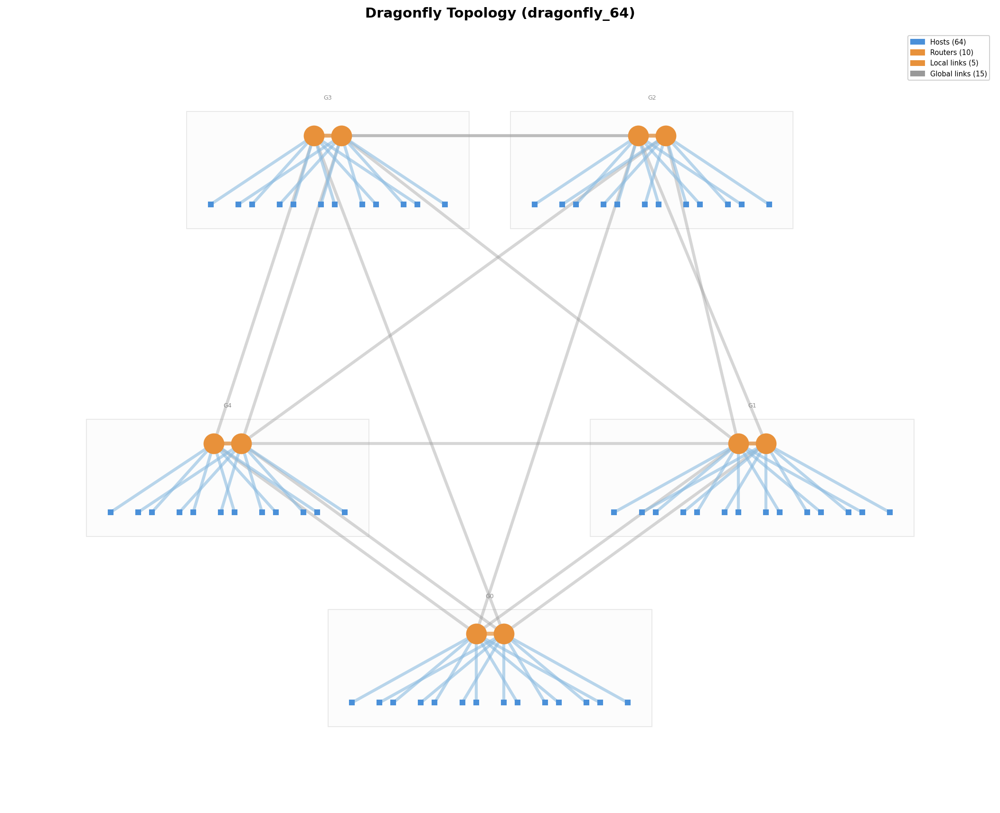

# CLOS & Dragonfly Topology Generator

CLOS (leaf-spine) and Dragonfly topology generators for HPC network simulation.
Produces optimized fabrics with the minimum number of switches/routers
while maintaining full symmetry and bisection bandwidth.

Google Slide Presentation: [link](https://docs.google.com/presentation/d/1KPUpbwwkNCe5dkujLZHlIwLRMtDhSrhHGaB6vuhhZjk/edit?usp=sharing)

## CLOS Task

Build a CLOS topology generation script that takes:

- **Switch throughput** -- total switching capacity per switch (e.g. 6400 Gbps)
- **NIC throughput** -- total escape throughput per network card (e.g. 800 Gbps)
- **Link bandwidth** -- per-link bandwidth (e.g. 200 Gbps)
- **Host count** -- total number of hosts (e.g. 128)

And calculates a 2-layer CLOS topology with the minimum number of switches overall while staying symmetric and having no oversubscription.

### Requirements

1. **ID scheme**: `[0, num_hosts-1]` for hosts, `[num_hosts, num_hosts+num_switches-1]` for switches.
2. **Output format**: JSON file containing a list of point-to-point links as `[src, dst, speed]` tuples.
3. **Link aggregation**: Aggregate multiple links between the same device pair when possible.
4. **Port reporting**: Output the utilized ports per layer and the number of switches per layer.

### Stretch Goals

- Robust sweep script over host counts `[4, 8, 16, 32, 64]` (powers of 2), idempotent so re-runs only trigger failed configurations.
- ~~Alternative topology support (e.g. Dragonfly).~~ **Done** -- see [Dragonfly Topology](#dragonfly-topology) below.


## Example CLOS Architecture


Note: The picture above has been generated by this repo (sweep.py)

## Quick Start

```bash
# Install uv (if not already installed)
curl -LsSf https://astral.sh/uv/install.sh | sh

# --- CLOS ---
uv run clos-generate \
  --switch-throughput 6400 \
  --nic-throughput 800 \
  --link-bandwidth 200 \
  --num-hosts 128

uv run clos-sweep \
  --switch-throughput 6400 \
  --nic-throughput 800 \
  --link-bandwidth 200

# --- Dragonfly ---
uv run dragonfly-generate \
  --switch-throughput 6400 \
  --nic-throughput 800 \
  --link-bandwidth 200 \
  --num-hosts 128

uv run dragonfly-sweep \
  --switch-throughput 6400 \
  --nic-throughput 800 \
  --link-bandwidth 200

# --- Dragonfly High-BW ---
uv run dragonfly-high-bw-generate \
  --switch-throughput 6400 \
  --nic-throughput 800 \
  --link-bandwidth 200 \
  --num-hosts 128 \
  --router-budget-factor 2.0

uv run dragonfly-high-bw-sweep \
  --switch-throughput 6400 \
  --nic-throughput 800 \
  --link-bandwidth 200 \
  --router-budget-factor 2.0

```

All commands produce a `.json` topology file and a `.png` network diagram
side-by-side in the output directory (e.g. `output_clos/topo_128.json` +
`output_clos/topo_128.png` for CLOS, `output_dragonfly/dragonfly_64.json` +
`output_dragonfly/dragonfly_64.png` for Dragonfly, and
`output_dragonfly_high_bw/dragonfly_64.json` +
`output_dragonfly_high_bw/dragonfly_64.png` for Dragonfly High-BW).

## Parameters

| Parameter | Required | Description | Example |
|---|---|---|---|
| `--switch-throughput` | Yes | Total switching capacity per switch (Gbps) | 6400 |
| `--nic-throughput` | Yes | Escape throughput per NIC (Gbps) | 800 |
| `--link-bandwidth` | Yes | Per-link bandwidth (Gbps) | 200 |
| `--num-hosts` | Yes | Total number of hosts (single run only) | 128 |
| `--output` | No | Output JSON path (single run only, default: `output_clos/topo_{num_hosts}.json`, `output_dragonfly/dragonfly_{num_hosts}.json`, or `output_dragonfly_high_bw/dragonfly_{num_hosts}.json`) | `output_clos/topo_128.json` |
| `--output-dir` | No | Output directory (sweep only, default: `output_clos/`, `output_dragonfly/`, or `output_dragonfly_high_bw/`) | `output_dragonfly/` |
| `--router-budget-factor` | No | Allow up to `ceil(min_routers * factor)` routers for better balance (High-BW only, default: 2.0) | 3.0 |
| `--force` | No | Re-generate even if output exists (sweep only) | - |

## How It Works

### CLOS Calculation

Given switch throughput `S`, NIC throughput `E`, link bandwidth `B`, and host count `N`:

```
ports_per_switch     = S / B          (e.g. 6400/200 = 32)
links_per_host       = E / B          (e.g. 800/200 = 4)
south_ports          = ports / 2      (e.g. 16)  -- non-oversubscribed split
north_ports          = ports / 2      (e.g. 16)
hosts_per_leaf       = south / links  (e.g. 16/4 = 4)
num_leafs            = N / hosts_per_leaf
```

Spine count is determined by two constraints:

1. **Leaf constraint** -- each leaf's north ports must be fully consumed:
   `links_per_pair * num_spines == north_ports`
2. **Spine constraint** -- each spine must have enough ports for all leafs:
   `links_per_pair * num_leafs <= ports_per_switch`

The algorithm maximizes `links_per_pair` (largest **INTEGER** divisor of `north_ports`
that satisfies the spine constraint), which in turn minimizes `num_spines`:

```
max_links_per_pair   = ports_per_switch // num_leafs
links_per_pair       = largest_divisor(north_ports, <= max_links_per_pair)
num_spines           = north_ports / links_per_pair
```

**`max_links_per_pair`**: Each spine must connect to every leaf. A spine has
`ports_per_switch` ports to distribute across `num_leafs` leafs, so the
maximum parallel links it can dedicate to any single leaf is
`ports_per_switch // num_leafs`. Floor division because ports are discrete
physical connectors (e.g. 32 ports / 5 leafs = 6, not 6.4).

**`links_per_pair`**: The leaf constraint (`links_per_pair * num_spines ==
north_ports`) requires `links_per_pair` to divide `north_ports` evenly --
otherwise some north ports would be left unconnected, wasting bandwidth.
So we pick the largest divisor of `north_ports` that is still within the
spine's per-leaf budget (`<= max_links_per_pair`). Larger `links_per_pair`
means fewer spines needed, which minimizes total switch count.

For example with 32-port switches and 4 leafs: `max_links_per_pair = 32/4 = 8`,
`north_ports = 16`, `links_per_pair = 8` (largest divisor of 16, <= 8),
`num_spines = 16/8 = 2`.

### No Oversubscription

Each leaf dedicates exactly half its ports southbound (to hosts) and half
northbound (to spines), guaranteeing equal bandwidth in both directions.
This provides full bisection bandwidth -- any host can communicate with any
other host at full NIC line rate.

### ID Scheme

| Entity | ID Range |
|---|---|
| Hosts | `[0, num_hosts - 1]` |
| Leaf switches | `[num_hosts, num_hosts + num_leafs - 1]` |
| Spine switches | `[num_hosts + num_leafs, num_hosts + num_leafs + num_spines - 1]` |

### Output Format

JSON file containing a list of point-to-point links:

```json
[
  [src_id, dst_id, bandwidth_gbps],
  [0, 128, 800],
  [128, 160, 200],
  ...
]
```

Multiple physical links between the same device pair are aggregated into a
single entry with the combined bandwidth.

## Example Output (128 hosts)

```
=== 2-Layer CLOS Topology ===
Hosts:          128
  IDs:          [0, 127]
  Links/host:   4 x 200G (aggregated: 800G)
Leaf switches:  32
  IDs:          [128, 159]
  South ports:  16/16 used
  North ports:  16/16 used
  Total ports:  32/32 used
Spine switches: 16
  IDs:          [160, 175]
  Ports used:   32/32 used
Total switches: 48
Total links:    640
```

## Sweep Runner

The sweep script generates topologies for host counts `[4, 8, 16, 32, 64]`:

```bash
uv run clos-sweep --switch-throughput 6400 --nic-throughput 800 --link-bandwidth 200
```

- **Idempotent**: skips runs where the output file already exists
- **Re-run failed only**: just run again -- completed outputs are preserved
- **Force regeneration**: use `--force` to overwrite existing files

## Special Cases in the Sweep

### N = 4: The Degenerate CLOS

With only 4 hosts and the default parameters (6400G switch, 800G NIC, 200G links),
the math yields **1 leaf** and **1 spine**. Since all hosts attach to a single leaf,
the spine appears redundant, the leaf's internal backplane can handle all
host-to-host traffic without an extra hop.

The spine is retained for three reasons:

1. **2-layer invariant.** Consumers of the topology JSON (routing simulations,
   BGP/ECMP test harnesses) expect two distinct switch tiers. Omitting the spine
   layer would break any code that indexes into "Tier 2" nodes.

2. **Bandwidth accounting.** The leaf uses 16 south ports for hosts and must
   expose 16 north ports to satisfy the non-oversubscription rule
   (bandwidth in = bandwidth out). The spine absorbs those 16 north links,
   keeping the CLOS math consistent even at minimum scale.

3. **Sweep consistency.** Keeping a uniform `leaf + spine` structure across all
   host counts avoids branching logic (`if num_leaves > 1: add_spines()`).
   The algorithm handles N = 4 and N = 64 with the same code path.

```
N = 4 wiring:

  Host 0 ─┐ 
  Host 1 ─┤── Leaf 4 ──── Spine 5 (16 links down)
  Host 2 ─┤  (16S + 16N)
  Host 3 ─┘

  Leaf 4:  16/32 ports south (hosts), 16/32 ports north (spine)
  Spine 5: 16/32 ports used
```

### N = 8: The Minimal Non-Trivial CLOS

At 8 hosts the spine becomes **structurally required**. Two leaves each serve
4 hosts, and in a CLOS topology leaves never connect directly to each other --
all inter-leaf traffic must traverse the spine layer.

Without the spine, Leaf A and Leaf B are isolated islands: hosts on one leaf
have no physical path to hosts on the other.

```
N = 8 wiring:

  Hosts 0-3 ── Leaf 8 ──┐
                        ├── Spine 10 (32/32 ports)
  Hosts 4-7 ── Leaf 9 ──┘

  Leaf 8:   16 south ports (hosts) + 16 north ports (spine)
  Leaf 9:   16 south ports (hosts) + 16 north ports (spine)
  Spine 10: 16 links from Leaf 8 + 16 links from Leaf 9 = 32/32 ports saturated
```

The spine is perfectly saturated: 16 north links from each leaf consume all 32
spine ports. This is the smallest scale where the spine provides actual
inter-leaf switching, not just topological correctness.

## Dragonfly Topology

The Dragonfly topology is a hierarchical network with three levels: **router,
group, system**. Routers within a group are fully connected (all-to-all), and
groups are interconnected by global links. This minimizes expensive long-distance
cables while keeping network diameter low (at most one global hop on minimal
routes).



### Dragonfly Quick Start

```bash
uv run dragonfly-generate \
  --switch-throughput 6400 \
  --nic-throughput 800 \
  --link-bandwidth 200 \
  --num-hosts 128

uv run dragonfly-sweep \
  --switch-throughput 6400 \
  --nic-throughput 800 \
  --link-bandwidth 200

uv run dragonfly-high-bw-generate \
  --switch-throughput 6400 \
  --nic-throughput 800 \
  --link-bandwidth 200 \
  --num-hosts 128 \
  --router-budget-factor 2.0

uv run dragonfly-high-bw-sweep \
  --switch-throughput 6400 \
  --nic-throughput 800 \
  --link-bandwidth 200 \
  --router-budget-factor 2.0
```

### Dragonfly Parameters

The topology is defined by four core parameters:
- `p` = hosts per router
- `a` = routers per group
- `h` = global links per router
- `g` = number of groups (2 <= g <= a*h + 1)
derived from the same physical inputs as CLOS:

```
ports_per_switch (k) = switch_throughput / link_bandwidth
links_per_host       = nic_throughput / link_bandwidth
```

Each router's `k` ports are partitioned into:

| Port type | Count | Description |
|---|---|---|
| Terminal | `p * links_per_host` | Connections to hosts |
| Local | `a - 1` | Intra-group (all-to-all) |
| Global | `h` | Inter-group |

These satisfy: `p * links_per_host + (a - 1) + h = k`: every physical
port on the switch is assigned exactly one role, with nothing wasted or
overcommitted.

The generator searches over valid `(a, h, p, g)` combinations that satisfy the
port equation and host-capacity constraints.

### Dragonfly Optimization Parameters

The optimizer in `src/dragonfly_generator/topology.py` uses this objective:

1. **Minimize router count first**: `total_routers = a * g`
2. **Tie-break by balance** (topology symmetry): minimize
   `|a - 2h| + |a - 2p*links_per_host|` — classical Dragonfly theory recommends
   `a ≈ 2h` to keep local connectivity proportional to global bandwidth, avoiding
   inter-group bottlenecks without wasting ports. The second term `a ≈ 2p*links_per_host`
   ensures host injection rate scales with internal/global path capacity, preventing
   designs where many hosts are served by too few network paths.
3. **Tie-break by overprovisioning** (packing efficiency): minimize
   `capacity - num_hosts` — prefers designs that waste the fewest host slots.
   E.g. two designs both using the same routers but capacities 160 vs 132 for
   128 hosts: the latter wastes only 4 slots instead of 32.

This is a lexicographic optimization: lower router count dominates all other
criteria. The trade-off is that aggressively minimizing routers can starve
inter-group bandwidth: e.g. the 128-host result assigns only `h=1` global link
per router, creating a significant bottleneck between groups. The overall
network cost is still much lower than CLOS.

See [Dragonfly High-BW Variant](#dragonfly-high-bw-variant).

### Dragonfly Design Philosophy (This Implementation)

- **Hardware-feasible first**: every candidate must satisfy exact integer port
  accounting (`p*links_per_host + (a-1) + h = k`)
- **Minimum infrastructure**: prefer fewer routers, then better balance
- **Deterministic construction**: no randomness in parameter search or wiring
- **Degree-correct global fabric**: global wiring enforces exactly `h` global
  ports on every router and target group degree `a*h`
- **Simple output contract**: flat `[src, dst, speed]` links with aggregated
  host-to-router bandwidth

#### Design Problems Implied by These Parameters

- **Router-count-first bias can underprovision global bandwidth**: minimizing
  `a*g` tends to pick low `h` at larger host counts (for 128 hosts, current
  solution uses `h=1`), which increases inter-group contention.
- **No explicit bandwidth objective**: optimization does not directly maximize
  bisection bandwidth, minimize global oversubscription, or optimize worst-case
  all-to-all traffic.
- **Host-capacity favored over path diversity**: high `p` is often selected
  when it reduces router count, but this can reduce available global channels
  per router.
- **Deterministic least-loaded wiring is valid, not traffic-aware**: degree
  constraints are satisfied exactly, but wiring is not optimized for workload
  locality or specific traffic matrices.
- **Single-objective economics**: CAPEX efficiency is excellent, but the model
  intentionally leaves performance-oriented choices to future policy modes.

#### Alternative Dragonfly Parameter Policies

Use the same feasibility constraints (`p*links_per_host + (a-1) + h = k`,
`2 <= g <= a*h + 1`, and `N = p*a*g`) with different selection objectives:

1. **Global-bandwidth-first**
   - Objective: maximize `h` first, then minimize routers.
   - Effect: stronger inter-group capacity and better all-to-all behavior.
2. **Balanced policy**
   - Objective: minimize `|a - 2h|` first (and optionally `|a - 2p*links_per_host|`).
   - Rationale: each router has `(a-1)` local links and `h` global links;
     traffic follows a local-global-local path (max 3 hops). Too few global
     links create inter-group bottlenecks, too many waste expensive cables.
     Under uniform traffic roughly half stays local and half leaves the group,
     so balanced throughput occurs when `a ≈ 2h`. Minimizing `|a - 2h|` pushes
     toward that sweet spot — similar scaling of local and global bandwidth
     with fewer congestion hotspots. See [Dragonfly High-BW Variant](#dragonfly-high-bw-variant).
3. **Oversubscription-bounded**
   - Objective: enforce minimum global-to-terminal ratio (e.g. `h >= alpha * p*links_per_host`),
     then minimize routers.
   - Effect: predictable upper bound on global bottlenecks.
4. **Path-diversity-first**
   - Objective: prefer larger `g` and/or `h` under fixed feasibility.
   - Effect: more inter-group route choices at higher router cost.
5. **Pareto frontier mode**
   - Objective: return multiple non-dominated `(a,h,p,g)` choices across
     router count vs global bandwidth.
   - Effect: makes cost/performance trade-offs explicit instead of hard-coding one point.

For the 128-host case (`k=32`, `links_per_host=4`), valid alternatives include:

- **Cost-optimal (current)**: `a=4, h=1, p=7, g=5` (`20` routers)
- **Balanced/high-global**: `a=4, h=5, p=6, g=6` (`24` routers)
- **Global-heavy**: `a=5, h=4, p=6, g=5` (`25` routers)

All are valid Dragonfly designs; they differ in infrastructure cost vs
inter-group bandwidth.


### Network Size

```
maximum-size groups: g_max = a * h + 1
actual groups:       2 <= g <= g_max   (chosen by optimizer)
total_hosts:         p * a * g
total_routers:       a * g
```

### ID Scheme

| Entity | ID Range |
|---|---|
| Hosts | `[0, num_hosts - 1]` |
| Routers | `[num_hosts, num_hosts + total_routers - 1]` |

### Link Types

1. **Host-to-router** -- `p` hosts per router, each with `links_per_host`
   physical links aggregated into a single entry.
2. **Intra-group (local)** -- all-to-all within each group, `a*(a-1)/2` unique
   pairs per group, 1 link per pair at base link bandwidth.
3. **Inter-group (global)** -- built as a regular group-level multigraph, then
   mapped onto routers with least-loaded placement. Each router uses exactly
   `h` global ports.

### Example Output (64 hosts, current implementation)

```
=== Dragonfly Topology ===
Hosts:              64
  IDs:              [0, 63]
  Links/host:       4 x 200G (aggregated: 800G)
Routers:            10  (a=2, g=5)
  IDs:              [64, 73]
  Terminal ports:   28 (p=7, links_per_host=4)
  Local ports:      1 (a-1=1)
  Global ports:     3
  Ports used:       32/32
Groups:             5
  Routers/group:    2
  Hosts/group:      14
  Intra-group links:1 per group
Total links:        84
```

### Dragonfly Sweep Runner

```bash
uv run dragonfly-sweep --switch-throughput 6400 --nic-throughput 800 --link-bandwidth 200
```

Same idempotency semantics as the CLOS sweep: skips existing outputs, supports
`--force`, reports per-configuration results.

### Dragonfly vs CLOS (Pros/Cons)

| Aspect | Dragonfly (this repo) | CLOS (this repo) |
|---|---|---|
| Topology depth / hop profile | **Pro**: hierarchical groups can keep diameter low with fewer stages | **Con vs Dragonfly**: fixed 2-stage leaf/spine path for inter-leaf traffic |
| Infrastructure count objective | **Pro**: optimizer targets minimum routers first (`a*g`) | **Pro**: also minimizes switches, but under strict 2-layer structure |
| Long-distance wiring pressure | **Pro**: global links are explicit and degree-constrained (`h` per router), often reducing high-cost inter-group cabling | **Con**: every leaf connects northbound to spines; can increase core-facing cabling |
| Port budgeting flexibility | **Pro**: can trade terminal/local/global ports via `(p,a,h)` search | **Con**: fixed 50/50 south/north split may be less flexible for some host targets |
| Operational simplicity | **Con**: more parameters (`a,h,p,g`) and richer wiring rules | **Pro**: simpler mental model (leaf/spine) and easier to reason about |
| Uniformity / predictability | **Con**: optimized Dragonfly may choose small groups or high `h` at low `N` (can look unintuitive) | **Pro**: structure stays consistent across scales in this implementation |
| Link semantics in output | **Con**: three link classes (host/local/global) to analyze | **Pro**: two main classes (host-leaf, leaf-spine) are easier to inspect |

Practical rule of thumb in this project: use Dragonfly when router-count
efficiency and global-link degree control matter most; use CLOS when simpler
layout, easier operations, and predictable 2-layer behavior are preferred.

### Dragonfly High-BW Variant

The High-BW variant in `src/dragonfly_high_bw_generator/topology.py` keeps the
same feasibility constraints but uses a **router-budget** approach:

1. Find the minimum achievable router count across all valid configurations.
2. Allow configurations with up to `ceil(min_routers * budget_factor)` routers.
3. Within that budget, optimize for balance:
   - Minimize `|a - 2h|` (global-link balance)
   - Then minimize `|a - 2p*links_per_host|` (terminal balance)
   - Then minimize total routers (prefer fewer within budget)
   - Then minimize `capacity - num_hosts` (host overprovisioning)

The `--router-budget-factor` (default: 2.0) controls how many extra routers
the optimizer may use relative to the absolute minimum. For example, if the
minimum feasible router count is 10, a budget factor of 2.0 allows up to
`ceil(10 * 2.0) = 20` routers. Higher factors give the optimizer more room
to pick balanced `(a, h)` values at the cost of more hardware. The baseline
is always the minimum router count that can physically accommodate the
requested host count with the given switch radix.

This trades a modest increase in router count for significantly better bandwidth
balance, especially at higher host counts where minimum-router configs are
heavily constrained.

Default output path for this variant is:

- Single run: `output_dragonfly_high_bw/dragonfly_{num_hosts}.json`
- Sweep: `output_dragonfly_high_bw/dragonfly_{num_hosts}.json` + `.png`

## Dragonfly - Various Configs Performances

All configurations use: switch throughput = 6400 Gbps, NIC throughput = 800 Gbps, link bandwidth = 200 Gbps.

### 32 Hosts

| Metric | Standard (`dragonfly_generator`) | High-BW (budget 2.0) | High-BW (budget 3.0) |
|---|---|---|---|
| Groups (g) | 2 | 2 | 2 |
| Routers | 6 (a=3) | 12 (a=6) | 12 (a=6) |
| Global links | 18 | 18 | 18 |
| Intra-group BW (Gbps) | 600 | 3000 | 3000 |
| Group-to-group BW (Gbps) | 3600 | 3600 | 3600 |

### 64 Hosts

| Metric | Standard (`dragonfly_generator`) | High-BW (budget 2.0) | High-BW (budget 3.0) |
|---|---|---|---|
| Groups (g) | 5 | 2 | 2 |
| Routers | 10 (a=2) | 12 (a=6) | 28 (a=14) |
| Global links | 15 | 18 | 98 |
| Intra-group BW (Gbps) | 200 | 3000 | 18200 |
| Group-to-group BW (Gbps) | 200-400 | 3600 | 19600 |

### 128 Hosts

| Metric | Standard (`dragonfly_generator`) | High-BW (budget 2.0) | High-BW (budget 3.0) |
|---|---|---|---|
| Groups (g) | 5 | 4 | 4 |
| Routers | 20 (a=4) | 24 (a=6) | 56 (a=14) |
| Global links | 10 | 36 | 196 |
| Intra-group BW (Gbps) | 1200 | 3000 | 18200 |
| Group-to-group BW (Gbps) | 200 | 1200 | 6400-6600 |

### Observations

- **Standard generator bottlenecks at scale.** At 64 and 128 hosts, intra-group BW drops to 200-1200 Gbps and group-to-group BW to 200 Gbps — both far below NIC capacity. The optimizer minimizes routers at the cost of very small groups (a=2-4) and few global links.
- **High-BW budget 2.0 is a cost-effective middle ground.** Doubling the router budget yields 3000 Gbps intra-group BW across all sizes and 15-30x better inter-group BW at 128 hosts (1200 vs 200 Gbps), with only 20% more routers at 128 hosts.
- **Budget 3.0 dominates at 64+ hosts but over-provisions at 32.** At 32 hosts, budget 3.0 produces identical topology to 2.0 (both saturate at a=6, g=2). The investment only pays off at 64+ hosts where it delivers 18200 Gbps intra-group and near-switch-capacity inter-group BW.
- **Intra-group BW scales quadratically with `a`.** Since local links are all-to-all, doubling routers-per-group roughly 4x the intra-group bandwidth (e.g., a=2: 200 Gbps vs a=14: 18200 Gbps).

## Source Modules

### CLOS (`src/clos_generator/`)

All CLOS source code lives under `src/clos_generator/`.

### `topology.py`

Core CLOS calculation engine.

- Takes four inputs: switch throughput, NIC throughput, link bandwidth, and host count.
- Derives all fabric parameters: ports per switch, links per host, hosts per leaf, leaf count, and spine count.
- Splits each switch's ports evenly between south (host-facing) and north (spine-facing) to guarantee non-oversubscription.
- Minimizes total switch count by maximizing the number of aggregated links per leaf-spine pair, constrained by spine port capacity.
- Generates the full link list as `(src_id, dst_id, bandwidth)` tuples, with multiple physical links between the same pair aggregated into a single entry.
- Returns a `ClosTopology` dataclass that holds all metadata, provides human-readable summaries, and exports to JSON.
- Validates all inputs upfront and raises clear errors for invalid combinations (indivisible throughput, odd port counts, etc.).

### `cli.py`

CLI entry point for single-topology generation (command: `clos-generate`).

- Parses `--switch-throughput`, `--nic-throughput`, `--link-bandwidth`, `--num-hosts`, and optional `--output` arguments.
- Calls `generate_clos_topology` and writes the link list to a JSON file (default: `output_clos/topo_{N}.json`).
- Automatically generates a matching PNG diagram alongside the JSON output.
- Prints the topology summary (host/leaf/spine counts, port utilization) to stdout.

### `sweep.py`

Batch runner that generates topologies across multiple host counts (command: `clos-sweep`).

- Iterates over host counts `[4, 8, 16, 32, 64]` (powers of 2).
- Idempotent: skips any host count whose output JSON already exists on disk.
- Supports `--force` to regenerate all outputs regardless of existing files.
- Produces both JSON and PNG for each host count.
- Reports a final summary categorizing each run as generated, skipped, or failed.
- Returns a non-zero exit code if any configuration failed validation.

### `visualize.py`

Renders a topology link list as a layered network diagram (command: `clos-visualize`).

- Infers node roles (host, leaf, spine) from the link structure without requiring external metadata.
- Places nodes in three horizontal layers (hosts at bottom, leafs in middle, spines on top) with even spacing.
- Draws host-to-leaf and leaf-to-spine links with distinct colors and line weights.
- Scales node sizes and label visibility based on topology size (labels hidden for layers with >32 nodes).
- Includes a legend with per-layer node counts and tier labels on the left margin.
- Used as a library function by `cli.py` and `sweep.py`, but also exposes its own standalone CLI for re-rendering existing JSON files to PNG.

### Dragonfly (`src/dragonfly_generator/`)

#### `topology.py`

Core Dragonfly calculation engine.

- Takes the same four inputs as CLOS: switch throughput, NIC throughput, link bandwidth, and host count.
- Searches valid `(a, h, p, g)` configurations with lexicographic objective:
  minimum routers, then balance, then minimum host slack.
- Generates three link types: host-to-router (aggregated), intra-group
  (all-to-all), and inter-group (regular-multigraph global wiring).
- Returns a `DragonflyTopology` dataclass with metadata, summaries, and JSON export.

#### `cli.py`

CLI entry point for single-topology generation (command: `dragonfly-generate`).

- Same arguments as `clos-generate` with default output path `output_dragonfly/dragonfly_{N}.json`.
- Produces both JSON and PNG output.

#### `sweep.py`

Batch runner across host counts `[4, 8, 16, 32, 64]` (command: `dragonfly-sweep`).

- Same idempotency and reporting semantics as `clos-sweep`.
- Output files: `output_dragonfly/dragonfly_{N}.json` + `.png`.

#### `visualize.py`

Renders a Dragonfly topology as a grouped network diagram (command: `dragonfly-visualize`).

- Arranges groups in a circular layout with routers clustered per group.
- Draws host, local, and global links with distinct colors and styles.
- Infers group structure from the link list without external metadata.

### Dragonfly High-BW (`src/dragonfly_high_bw_generator/`)

#### `topology.py`

High-bandwidth-focused Dragonfly calculation engine.

- Uses the same feasibility checks and wiring model as the base Dragonfly implementation.
- Changes the optimization objective to lexicographic:
  minimize `|a - 2h|`, then `|a - 2p*links_per_host|`, then host slack.
- Does not minimize total router count first.

#### `cli.py`

Single-topology High-BW generator (command: `dragonfly-high-bw-generate`).

- Same required arguments as `dragonfly-generate`.
- Default output path: `output_dragonfly_high_bw/dragonfly_{N}.json`.

#### `sweep.py`

Batch High-BW generator across host counts `[4, 8, 16, 32, 64]`
(command: `dragonfly-high-bw-sweep`).

- Same idempotency and reporting semantics as `dragonfly-sweep`.
- Output files: `output_dragonfly_high_bw/dragonfly_{N}.json` + `.png`.

## Validation

The generators will error with a clear message if the inputs don't produce a
valid topology. Common issues:

**CLOS:**
- Switch throughput not divisible by link bandwidth
- NIC throughput not divisible by link bandwidth
- Odd number of ports per switch (can't split evenly)
- Host count not divisible by hosts-per-leaf
- Too many leafs for the spine port capacity

**Dragonfly:**
- Switch throughput not divisible by link bandwidth
- NIC throughput not divisible by link bandwidth
- No valid (a, h, p) configuration found for the given host count and switch radix
